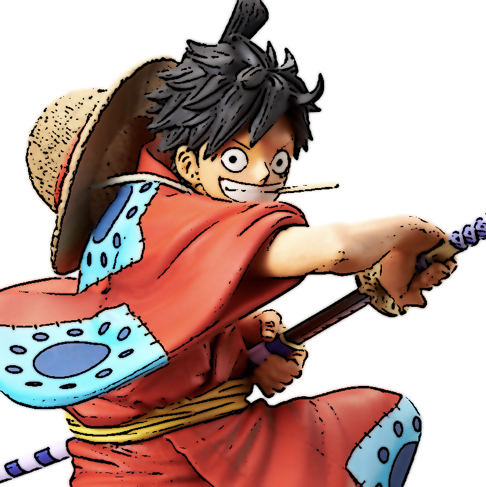
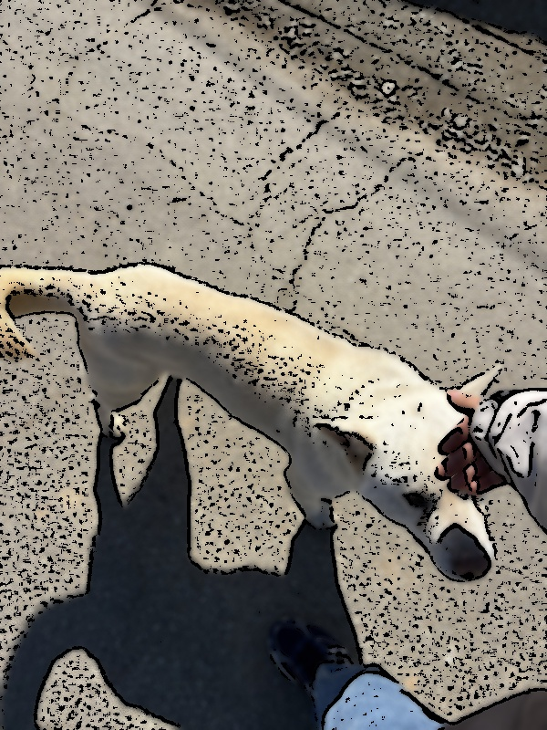

# Cartoon Rendering (casual_to_animated)

## 💻 Program Description

This project is a Python-based image processing tool that converts standard photographs into cartoon-style images. Using OpenCV, the program applies a combination of edge detection and color smoothing algorithms to replicate the visual characteristics of a comic book or animation.

## ✨ Key Features

- **Auto-Resizing:** Automatically scales down oversized images (max width/height of 800px) for optimal processing speed and display, while maintaining the original aspect ratio.
- **Edge Extraction (Sketch Effect):** Utilizes `cv2.medianBlur` to reduce noise and `cv2.adaptiveThreshold` to extract clean, detailed outlines that mimic a cartoonist's ink strokes.
- **Color Simplification (Watercolor Effect):** Applies `cv2.bilateralFilter` to smooth out internal textures and unify colors while strictly preserving the detected boundaries.
- **Cartoon Synthesis:** Merges the extracted sketch lines with the simplified color image using a bitwise AND mask (`cv2.bitwise_and`), resulting in the final cartoon rendering.
- **Automated File Saving:** Automatically generates and saves the output image to the local directory with a `cartoon_` prefix for easy comparison.

## 1. Successful Demo (Well-Expressed Image)

In this example, the algorithm successfully converts the image into a cartoon style. The object has clear boundaries and relatively uniform colors, allowing the Bilateral Filter to smooth the surfaces effectively while the Adaptive Thresholding clearly captures the main outlines without excessive noise.

### Before

### After

## 2. Failed Demo (Poorly-Expressed Image)

This example demonstrates a scenario where the cartoon rendering algorithm does not perform well. The original image contains highly detailed textures (e.g., complex hair, grass) and an intricate background.

### Before

### After

## 3. Algorithm Limitations (Discussion)

Based on the results above, this cartoon rendering algorithm has a few distinct limitations:

- **Oversensitivity to Micro-Textures:** The `cv2.adaptiveThreshold` function calculates the threshold for small regions. While this is great for finding edges under varying illumination, it also treats micro-textures (like animal fur, grass, or low-light image noise) as hard edges. This results in severe black speckling, destroying the clean, simplified look typical of cartoons.
- **Lack of Semantic Segmentation:** True cartoon artists naturally simplify backgrounds and emphasize the main subject. Because this algorithm applies the exact same filtering universally across the entire image without separating the foreground object from the background, complex scenes become visually cluttered and chaotic.
- **Fixed Parameters:** The window sizes and sigma values for the Bilateral Filter and Adaptive Thresholding are hardcoded. An optimal cartoon effect requires different parameter tuning depending on the specific lighting and resolution of each image.
